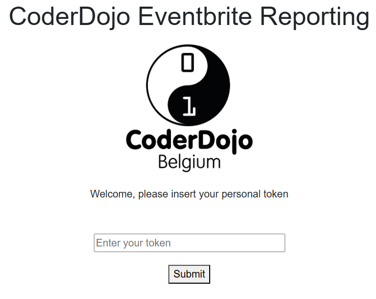
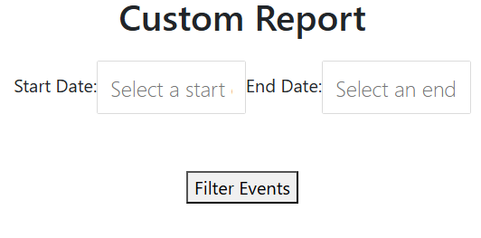

# CoderDojo EventBrite Reporting

Dash application used for reporting on the various ‘Dojos’ listed by CoderDojo Belgium

## Table of Contents
- [Presentation](#presentation)
- [Features](#features)
- [Getting Started](#getting-started)
  - [Prerequisites](#prerequisites)
  - [Installation](#installation)
  - [Run](#run)
- [Screenshots](#screenshots)

## Presentation

After authentication, the user can retrieve information on participants in Dojos taking place between two specified dates (age, gender, telephone number, address, etc.). The information can be filtered and then exported in .csv or .xlsx format.

## Features

- `api`: contains functions to resquest Eventbrite API in order to get informations about events or attendees
- `controler`: implementation of the authentication page and the main page
- `services`: uses responses return in `api` to extract and present in a more user friendly way informations about events or attendees
- `dist`: contains `app.exe`, the executable file to use the application
- `app.py`: Dash application written in Python

## Getting Started

### Prerequisites

- Python (>=3.10)
- Other dependencies (specified in `requirements.txt`)

### Installation

```bash
git clone https://github.com/yanisrem/CoderDojo-Eventbrite-Reporting.git
pip install -r requirements.txt
```
### Run
- In terminal: open `dist` folder in terminal and execute:
```bash
app.exe
```
- In Python:
```bash
python app.py
```
## Screenshots

<div style="text-align:center;">
  
  
</div>
